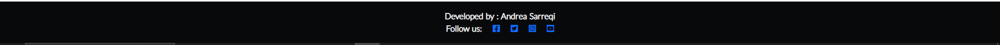
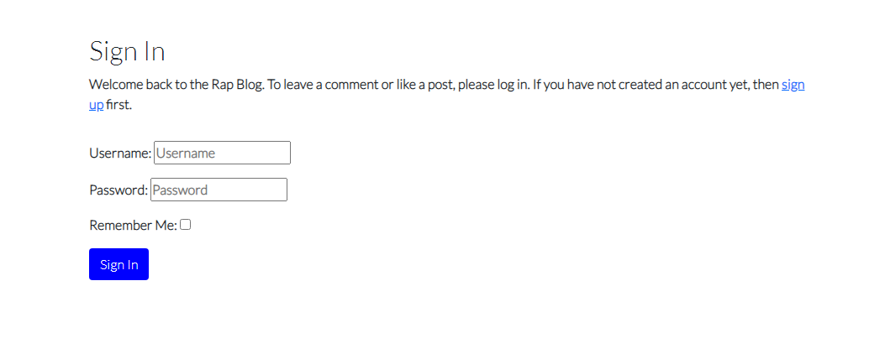
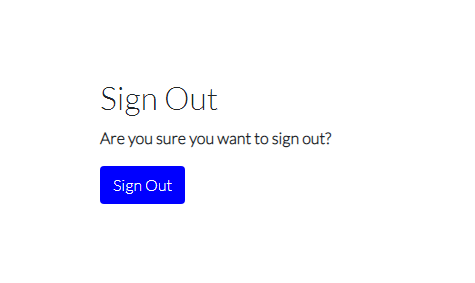
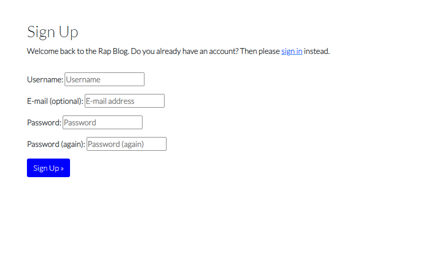
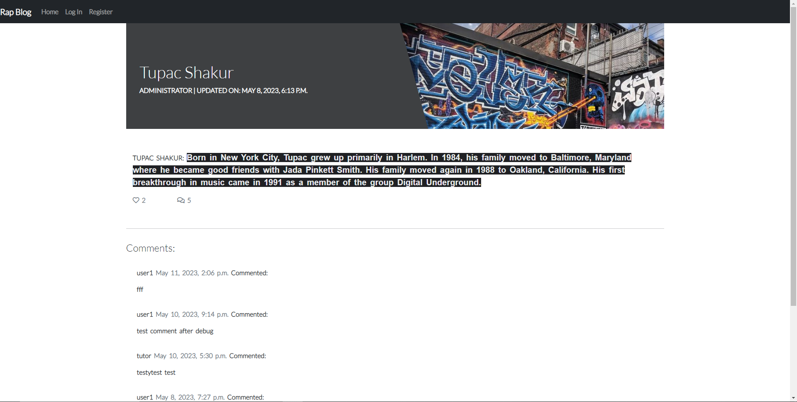
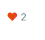
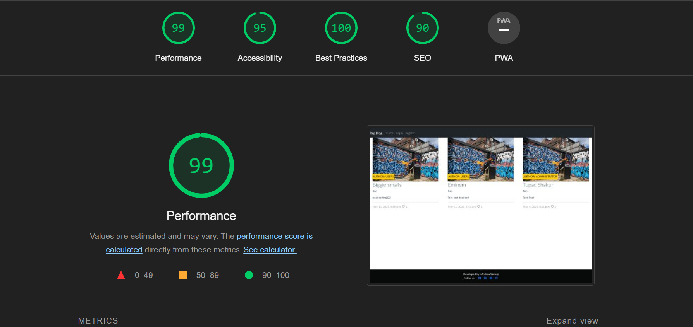

# Rap Blog

![Alt text])

[Live Web Application Link](https://rapblog.herokuapp.com/)

## Introduction

Welcome to my very own [Rap Blog](https://rapblog.herokuapp.com/).
I want to create a fun and responsive webiste about a genre of music i am a big fan of.
A web page where fans of rap music can share their own posts and have ufn doing it 

### Features

Favicon

- The icon on the Browser tab next to the website name.
- There to help the user navigate easier through the browser tab.

Main Page

Navigation Bar

Footer

Login Form

Logout Form

Register Frrm

Add a post 

My posts/Add Post

 Update/Delete Form

 Like/Comment a Post

 Responsiveness

## Technologies used

- HTML (Templates)
- CSS (Style sheet)
- Python + Django (Programming language + Framework)
- Git (Version Control)
- Github (Respository)
- CodeAnywhere(Cloud IDE)
- Heroku (Live Application Host)

### Future Features

- Display a message when user Logs in or Logs out of the web page.
- Create a Conatct Us page.
- Create My profile. Giving the user a change to view the posts they've liked or commented
- Adding group of posts based on music genre. When a genre is clicked upon, to be able to display posts in the respective genre.
- Email verification for registering new account.

## Testing

 Rap Blog - Manual Testing 

## Functionality

<table>
  <tr>
   <td>
<strong>Test Label</strong>
</li>
</ol>
   </td>
   <td><strong>Test Action</strong>
   </td>
   <td colspan="2" ><strong>Expected Outcome</strong>
   </td>
   <td><strong>Test Outcome </strong>
   </td>
  </tr>
  <tr>
   <td>Site loading
   </td>
   <td>Navigate the Home Page
   </td>
   <td colspan="2" >Nav bar with login/register buttons and posts user can interact with
   </td>
   <td>PASS
   </td>
  </tr>
  <tr>
   <td>Access Individual posts
   </td>
   <td>User is met with the name of the artist, short description,Comment area and leave a comment form(if logged in)
   </td>
   <td colspan="2" >Like/unlike button works and the comment form + submit button works(if logged in)
   </td>
   <td>PASS
   </td>
  </tr>
  <tr>
   <td>Login/Register buttons
   </td>
   <td>Clicking each button respectively and trying to interact with them.
   </td>
   <td colspan="2" > The user can register/login/logout of the web page
   </td>
   <td>PASS
   </td>
  </tr>
  <tr>
   <td>My Posts Button
   </td>
   <td>Clicking the My posts button
   </td>
   <td colspan="2" >The user gets redirected to a page that they can see the posts they've created, if they haven't done so yet a button is shwwn to help them do so.
   </td>
   <td>PASS
   </td>
  </tr>
  <tr>
   <td>Add Post button
   </td>
   <td>Click the add post button
   </td>
   <td colspan="2" >A form is displayed to a user helping them with neccessery fields to create a post of their own.
   </td>
   <td>PASS
   </td>
  </tr>
  <tr>
   <td>Update/Delete a post
   </td>
   <td>AClick the buttons on the cards shwon on My Posts page
   </td>
   <td colspan="2" > The user can Update/Delete the posts they've hreated. A form is displayed on the update page that they can add material or change it. A button is displayed on the delete pageg making sure the user really wants to delete a post of their making.
   </td>
   <td>PASS
   </td>
  </tr>
</table>
<ol>

## Browser Compatibility

The website works on different browsers: <strong>Chrome, Firefox and Edge.</strong>

### Responsiveness

- Responsiveness was tested using: Chrome Dev Tools.

- Mobile Devices.

## User Stories

All User Stories were successfully performed.
Each respective User Story was seperated in a milestone making for a more organised project and helping keeping track of tasks and functions planned to be implemented.
You can access them [here](https://github.com/andreasarreqi/blog/milestones)

## Validator Testing

HTML

HTML validator.

CSS

CSS validator.

Python Validator

PEP8 validator.

- Models
- 

- Views
- 

Lighthouse

Lighthouse.

WAVE

WAVE validator.

![Alt text]/static/images/wave.PNG)

### Unfixed Bugs / Other

- A few errors accur in the HTML validator but the web application works fine. The errors maybe appear due to use of Django elemetts in the HTML templates.

## Deployment

- The site was deployed to Heroku. The steps to deploy are as follows:
  - In the Heroku profile, create a new project, name must be unique, location set to Europe
  - 
  - From the the project you have just created you can go to the setting page.
  - Once in the settings page, Add the right Config Variables to the project. SECRET KEY DATABASE URL ets.
  - Then from there you go to the Deploy page and link your GitHub repo to the project u intented to deploy.
  - Then you can scroll at the end of the page and click on the Deploy Branch
  - After Heroku starts compiling the files and creating your app , after 1 minute or so you'll have your delpyed app link.
  - The deployed app can be found [here](https://rapblog.herokuapp.com/)

## Credits

- [Code Institute]()
- [Font Awesome.](https://fontawesome.com/)

- [Bootstrap](https://bootstrap.com)
- Bootstrap was user to create a responsive desing on all platforms.

- [Pexels](https://pexels.com)
- Images were taken from Pexels.

## Acknowledgements

- I would like to thank my mentor Daisy for guiding me.
